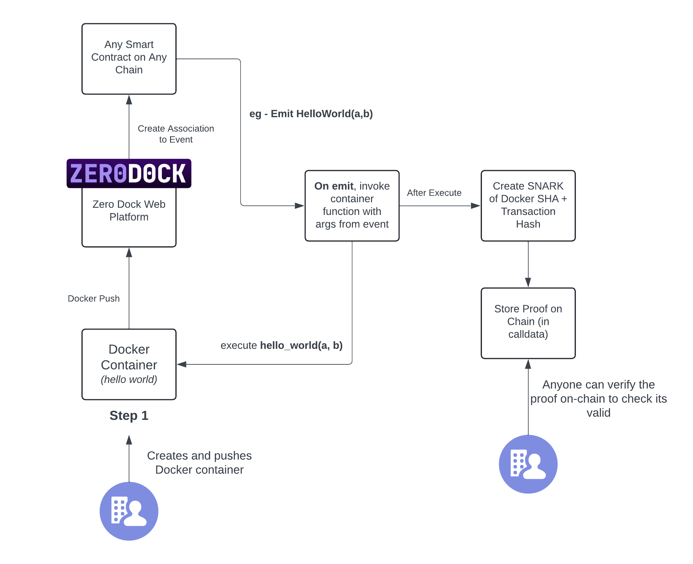
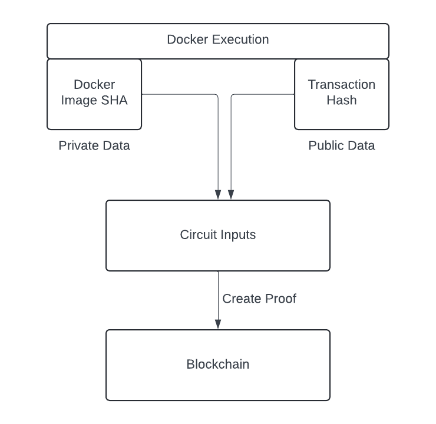

# ZeroDock

A co-processing (TEE) platform that allows any Docker container to run in a verifiable, trustless way utilizing ZK-SNARKs.

# Overview

# How Proofs are Created

Proofs are created for each execution and are stored on chain. We create these by combining the Transaction Hash and the Docker SHA (public and private data) into a circuit to create the proof. This is then stored on chain and can be used to verify that the transaction hash in question did in fact execute a Docker container with the SHA known by the developer (private data).!!!

# Smart Contract (Base Sepolia)

- [0x0ba547Ae5BCcf9a028aD69e0443268d46f9C28C1](https://sepolia.basescan.org/address/0x0ba547Ae5BCcf9a028aD69e0443268d46f9C28C1)
  - This is our "generator" smart contract that simply exists to Emit a simple event. There is no logic in it nor is there supposed to be. It showcases the entry point to our system by emitting an event. Zerodock works with any smart contract on any EVM chain, so to keep things streamlined from the hackathon we are just emitting a simple event called "Process" which emits **a** and **b** which are both uint256.
- [0x3631ab2ffa825f00d534e7cb831cc8c66b5d6f4b](https://sepolia.basescan.org/address/0x3631ab2ffa825f00d534e7cb831cc8c66b5d6f4b)
  - This is our "store" smart contract that simply stores ZK Proof data as calldata to be able to persist its value and allow for any viewer to be able to use it to verify the execution of any container run on the ZeroDock platform
